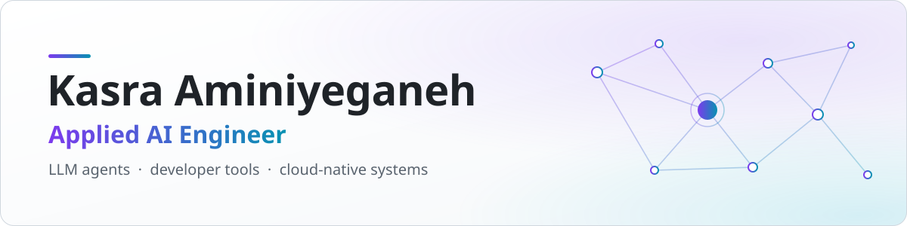
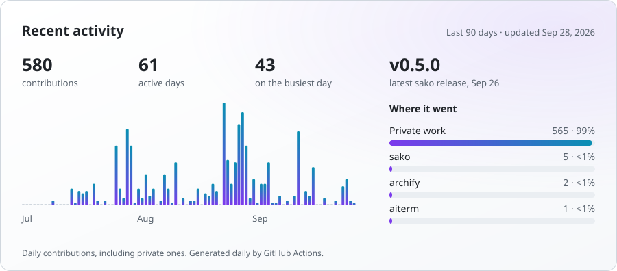

<picture>
  <source media="(prefers-color-scheme: dark)" srcset="assets/banner-dark.svg">
  <source media="(prefers-color-scheme: light)" srcset="assets/banner-light.svg">
  
</picture>

I build LLM agents and developer tools, and the cloud-native systems that run them. My focus is making AI dependable in daily use: agents that own their tasks, prove their work with checks, and leave clean commits. My foundation is Go, Python, Kubernetes and AWS.

## Featured work

- **[SAKO](https://github.com/Thakay/sako)** &nbsp; 
  Makes coding agents prove their work. When a Claude Code or Codex session stops, a finish gate checks that every change is recorded, tested and committed, then writes a receipt for each finished task. Pure Python, no dependencies.
- **[aiterm](https://github.com/Thakay/aiterm)** &nbsp; 
  Turns plain-English requests into Unix commands in your terminal, and lets you run, copy or edit each one before it executes. Go and the OpenAI API.
- **[object-detect](https://github.com/Thakay/object-detect)** 
  Benchmarks real-time object detection on a Raspberry Pi, CPU versus a Coral Edge TPU. Tracks FPS, CPU, memory and temperature for SSD MobileNet, EfficientDet-Lite and YOLOv5.
- **Open source:** merged [a cleanup to AutoGPT's memory module](https://github.com/Significant-Gravitas/AutoGPT/pull/1068) (2023).

Earlier work: <a href="https://github.com/Thakay/BayesianQRL">Bayesian Q-learning</a>, a reproduction of Dearden et al. (1998) in OpenAI Gym · <a href="https://github.com/Thakay/saytext">saytext</a>, a text-to-speech service over gRPC in Go

## Activity

<picture>
  <source media="(prefers-color-scheme: dark)" srcset="profile/activity-dark.svg">
  <source media="(prefers-color-scheme: light)" srcset="profile/activity-light.svg">
  
</picture>

<picture>
  <source media="(prefers-color-scheme: dark)" srcset="profile/stats-dark.svg">
  <source media="(prefers-color-scheme: light)" srcset="profile/stats-light.svg">
  
</picture>

<b>Stack</b>

 

- **AI and ML:** LLM APIs (OpenAI), Claude Code, Codex, TensorFlow Lite, YOLOv5, OpenCV, Jupyter
- **Languages:** Python, Go, C#, TypeScript
- **Cloud and infrastructure:** AWS, Azure, Kubernetes, Docker, Terraform, GitHub Actions, Linux
- **Data and messaging:** PostgreSQL, Redis, MongoDB, Kafka, gRPC

## Let's work together

I'm open to applied AI roles and to collaborating on coding-agent tooling, LLM developer tools, and AI features that need solid infrastructure.

- **Use Claude Code or Codex?** Try [SAKO](https://github.com/Thakay/sako) with `uvx sako init` and tell me what breaks. Issues and client test reports are welcome.
- **Have a project or role in mind?** [Send a collaboration request](https://github.com/Thakay/Thakay/issues/new?template=collaborate.yml).

The activity and stats cards are rebuilt daily by <a href=".github/workflows/profile-cards.yml">a GitHub Action</a> in this repo.
